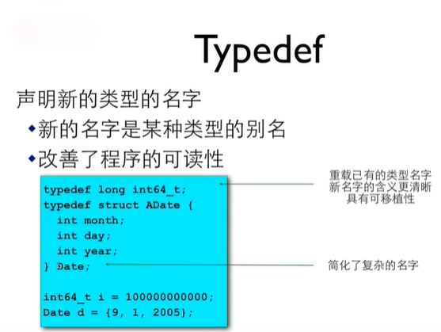

# 结构
1. 声明结构类型
```
#include <stdio.h>
int main(int argc, char const *argv[])
{
  struct data{
    int month;
    int day;
    int year;
  };
  struct data today;

  today.month = 07;
  today.day = 31;
  today.year = 2014;
  printf("Today's date os %i-%i-%i. \n",today.year,today.month,today.day);

  return 0;
}
```
## 声明结构的形式
```
struct point{
  int x;
  int y;
};
struct point p1, p2;
//p1和p2都是point里面有x和y的值
```

1. 和本地变量一样，在函数内部声明的结构类型只能在函数内部使用
2. 所以通常在函数外部声明结构类型，这样就可以被多个函数所使用了
### 结构的初始化
```
#include <stdio.h>
struct date {
  int month;  
  int day;
  int year;
};
int main(int argc, char const *argv[])
{
  struct date today = {07,31,2014};
  struct data thismonth = {.month = 7, .year = 2014};

  printf("Today's date is %i-%i-%i. \n",today.year,today.month,today.day);
  printf("This month is %i-%i-%i. \n",today.year,today.month,today.day);

  return 0;
}
```
### 结构成员
1. 结构和数组有点像 
2. 数组有[]运算符和下标访问其成员
   1. a[0] = 10;
3. 结构用.运算符和名字访问其成员
   1. today.day
   2. student.firstName
   3. p1.x
   4. p2.y
### 结构运算
- 要访问整个结构，直接用结构变量的名字
- 对于整个结构，可以做赋值、其地址，也可以传递给函数参数
  - p1 = (struct point){5,10}; //相当于p1.x = 5; p1.y = 10;
  - p1 = p2; // 相当于p1.x = p2.x; p1.y = p2.y;
### 结构指针
- 和数组不同，结构变量的名字并不是结构变量的地址，必须使用&运算符
- struct date *pData = &today;
## 结构和函数
### 结构作为函数参数
int numberOfDays(struct date d)
- 整个结构可以作为参数的值传入函数
- 这时候是在函数内新建一个结构变量，并复制调用者的结构的值
- 也可以返回一个结构
- 这与数组完全不同
```
#include <stdio.h>
#include <stdbool.h>

struct date{
  int month;
  int day;
  int year;
};
bool isLeap(struct date d);
int numberOfDays(struct date d);

int main(int argc, char const *argv[])
{
  struct date today, tomorrow;
  printf("Enter today's date (mm dd yyyy):");
  scanf("%i %i %i", &today.month, &today.day, &today.year);

  if (today.day != numberOfDays(today)){
  	tomorrow.day = today.day + 1;
  	tomorrow.month = today.month;
  	tomorrow.year = today.year;
  }else if (today.month == 12){
  	tomorrow.day = 1;
  	tomorrow.month = 1;
  	tomorrow.year = today.year + 1;
  }else{
  	tomorrow.day = 1;
  	tomorrow.month = today.month + 1;
  	tomorrow.year = today.year;
  }
  printf("Tomorrow's date is %i-%i-%i.\n", tomorrow.year, tomorrow.month, tomorrow.day);
  return 0; 
}
int numberOfDays(struct date d)
{
	int days;
	const int daysPerMonth[12] = {31,28,31,30,31,30,31,31,30,31,30,31};
	if (d.month == 2 && isLeap(d))
		days = 29;
	else
		days = daysPerMonth[d.month-1];
	return days;
}

bool isLeap(struct date d)
{
	bool leap = false;
	if ((d.year %4 ==0 && d.year %100 != 0) || d.year%400 == 0)
		leap = true;
	return leap;
}
```
### 结构指针作为参数
指向结构的指针
```
struct date{
  int month;
  int day;
  int year;
}myday;
struct date *p = &myday;

(*p).month = 12;
p -> month = 12;
```
用$->$表示指针所指的结构变量中的成员
## 结构中的结构
## 自定义数据类型（typedef）
- c语言提供了一个叫做typedef的功能来声明一个已有的数据类型的新名字。比如：
  typedef int Length；
  使得**Length**成为**int**类型的别名。
- 这样，**Length**这个名字就可以代替int出现在变量定义和参数声明的地方了：
  - Length a,b,len;
  - Length nnumbers[10];

# 联合
# 全局变量
- 定义在函数外面的变量是全局变量
- 全局变量具有全局的生存期和作用域
  - 它们与任何函数都无关
  - 在任何函数内部都可以使用它们
## 全局变量初始化
- 没有做初始化的全局变量会得到0值
  - 指针会得到NULL值
- 只能用编译时刻已知的值来初始化全局变量
- 它们的初始化发生在main函数之前
## 静态本地变量
- 在本地变量定义时加上static修饰符就成为静态本地变量
- 当函数离开的时候，静态本地变量会继续存在并保持其值
- 静态本地变量的初始化只会在第一次进入这个函数时做，以后进入函数时会保持上次离开时的值

1. 静态本地变量实际上是特殊的全局变量
2. 它们位于相同的内存区域
3. 静态本地变量具有全局的生存期，函数内的局部作用域
4. static在这里的意思是局部作用域（本地可访问）

## *返回指针的函数
- 返回本地变量的地址是危险的
- 返回全局变量或静态本地变量的地址是安全的
- 返回在函数内malloc的内存是安全的，但是容易造成问题
- 最好的做法是返回传入的指针
## tips
- 不要使用全局变量来在函数间传递参数和结果
- 尽量避免使用全局变量
- *使用全局变量和静态本地变量的函数是线程不安全的
